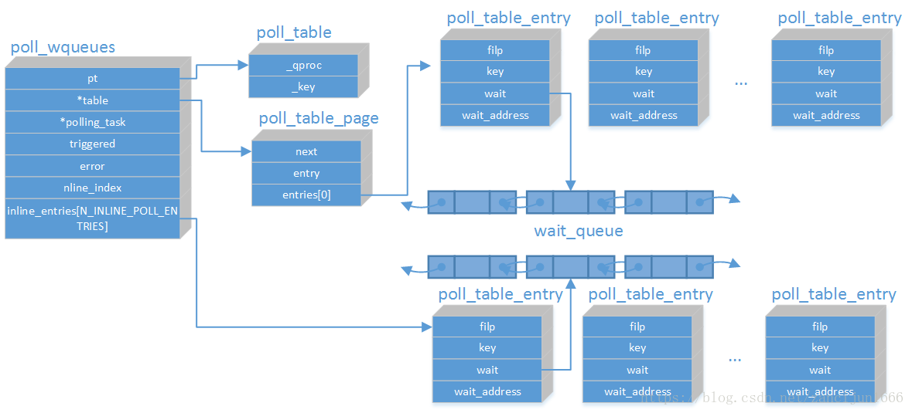

<!-- TOC -->

- [poll 源码概述](#poll-%E6%BA%90%E7%A0%81%E6%A6%82%E8%BF%B0)
  - [`poll`的定义](#poll%E7%9A%84%E5%AE%9A%E4%B9%89)
  - [`do_sys_poll`探索](#dosyspoll%E6%8E%A2%E7%B4%A2)
  - [`poll_initwait`初始化](#pollinitwait%E5%88%9D%E5%A7%8B%E5%8C%96)
  - [核心函数`do_poll`](#%E6%A0%B8%E5%BF%83%E5%87%BD%E6%95%B0dopoll)
  - [`poll`机制总结](#poll%E6%9C%BA%E5%88%B6%E6%80%BB%E7%BB%93)
  - [`poll`的缺点](#poll%E7%9A%84%E7%BC%BA%E7%82%B9)
  - [参考链接](#%E5%8F%82%E8%80%83%E9%93%BE%E6%8E%A5)

<!-- /TOC -->

# poll 源码概述

`poll`相对于`select`改进了`fdset size`的限制，`poll`没有再使用`fdset`数组结构，反而使用了`pollfd`，这样用户可以自定义非常大的`pollfd`数组，这个`pollfd`数组在`kernel`中的表现形式是`poll_list`链表，这样就不存在了1024的限制了，除此之外`poll`相比`select`无太大区别。


**`poll()`函数原型**

```c
int poll(struct pollfd* fds, unsigned int nfds, int timeout);
```

## `poll`的定义

`fs/select.c`

```c
SYSCALL_DEFINE3(poll, struct pollfd __user *, ufds, unsigned int, nfds,
        int, timeout_msecs)
{
    struct timespec64 end_time, *to = NULL;
    int ret;

    // 根据传入的时间参数计算超时时间，存放入一个 struct timespec结构体实例to中
    if (timeout_msecs >= 0) {
        to = &end_time;
        poll_select_set_timeout(to, timeout_msecs / MSEC_PER_SEC,
            NSEC_PER_MSEC * (timeout_msecs % MSEC_PER_SEC));
    }

    //调用do_sys_poll完成主要工作（实现轮询功能）
    ret = do_sys_poll(ufds, nfds, to);

    // do_sys_poll被信号中断的处理
    if (ret == -EINTR) {
        struct restart_block *restart_block;

        restart_block = &current->restart_block;
        restart_block->fn = do_restart_poll;
        restart_block->poll.ufds = ufds;
        restart_block->poll.nfds = nfds;

        if (timeout_msecs >= 0) {
            restart_block->poll.tv_sec = end_time.tv_sec;
            restart_block->poll.tv_nsec = end_time.tv_nsec;
            restart_block->poll.has_timeout = 1;
        } else
            restart_block->poll.has_timeout = 0;

        ret = -ERESTART_RESTARTBLOCK;
    }
    return ret;
}
```
```c
struct pollfd {
    int fd;
    short events;
    short revents;
};
```
主要包含三个事情

* 判断是否传入超时事件，如果传入超时时间，则调用`poll_select_set_timeout`函数对传入的超时时间进行转换，并且保存在`struct timespec`结构体实例`to`中
* 调用`do_sys_poll`完成核心工作，实现实际的轮询功能
* `do_sys_poll`被信号中断后的处理。如果`do_sys_poll`返回`-EINTR`，则意味着`poll`操作被信号打断，返回`ERESTART_RESTARTBLOCK`，由用户注册的信号如果设置了`SA_RESTART`，则可以在处理完用户注册的信号处理程序后，重新调用

## `do_sys_poll`探索

```c
static int do_sys_poll(struct pollfd __user *ufds, unsigned int nfds,
        struct timespec64 *end_time)
{
    // 创建一个struct poll_wqueues类型的挑选队列
    struct poll_wqueues table;
    int err = -EFAULT, fdcount, len, size;
    /* Allocate small arguments on the stack to save memory and be
        faster - use long to make sure the buffer is aligned properly
        on 64 bit archs to avoid unaligned access */
    // 为了加快处理速度和提高系统性能，这里优先使用已经定好的一个栈空间，其大小为POLL_STACK_ALLOC，栈空间转换为struct poll_list结构，以存储需要被检测的文件描述符
    long stack_pps[POLL_STACK_ALLOC/sizeof(long)];

    // struct poll_list类型的指针指向这个栈空间，便于之后块连接
    struct poll_list *const head = (struct poll_list *)stack_pps;
    struct poll_list *walk = head;

    // 需要处理的文件描述符总数
    unsigned long todo = nfds;

    // 如果nfds大于了打开的最大的文件描述符或者是大于规定打开的最大描述符的值，那么返回报错
    if (nfds > rlimit(RLIMIT_NOFILE))
        return -EINVAL;

    // 找到nfds和N_STACK_PPS的较小者，N_STACK_PPS为默认的固定栈能够存储struct pollfd的数目
    // #define N_STACK_PPS ((sizeof(stack_pps) - sizeof(struct poll_list))  / sizeof(struct pollfd))
    len = min_t(unsigned int, nfds, N_STACK_PPS);
    for (;;) {
        walk->next = NULL;
        walk->len = len;
        if (!len)
            break;

        // 将用户空间的struct pollfd中的len个数据拷贝到内核空间walk->entries中
        if (copy_from_user(walk->entries, ufds + nfds-todo,
                    sizeof(struct pollfd) * walk->len))
            goto out_fds;

        todo -= walk->len;
        if (!todo)
            break;

        len = min(todo, POLLFD_PER_PAGE);
        size = sizeof(struct poll_list) + sizeof(struct pollfd) * len;
        walk = walk->next = kmalloc(size, GFP_KERNEL);
        if (!walk) {
            err = -ENOMEM;
            goto out_fds;
        }
    }

    poll_initwait(&table);
    fdcount = do_poll(head, &table, end_time);
    poll_freewait(&table);

    for (walk = head; walk; walk = walk->next) {
        struct pollfd *fds = walk->entries;
        int j;

        for (j = 0; j < walk->len; j++, ufds++)
            if (__put_user(fds[j].revents, &ufds->revents))
                goto out_fds;
    }

    err = fdcount;
out_fds:
    walk = head->next;
    while (walk) {
        struct poll_list *pos = walk;
        walk = walk->next;
        kfree(pos);
    }

    return err;
}
```

**`do_sys_poll`需要从用户层中将所有`fds`拷贝到内核，在`fds`很多的时候还要申请内存，在返回的时候还要将`fds`拷贝回用户层，这就是广为诟病poll性能差的原因**。这个函数应该重点分析`do_poll`，但是`poll_initwait`也是很重要的，先看下这个函数做了什么初始化

## `poll_initwait`初始化

```c
/*
 * Structures and helpers for select/poll syscall
 */
struct poll_wqueues {
    poll_table pt;
    struct poll_table_page *table;
    struct task_struct *polling_task;
    int triggered;
    int error;
    int inline_index;
    struct poll_table_entry inline_entries[N_INLINE_POLL_ENTRIES];
};
```

```c
void poll_initwait(struct poll_wqueues *pwq)
{
    init_poll_funcptr(&pwq->pt, __pollwait);
    pwq->polling_task = current;
    pwq->triggered = 0;
    pwq->error = 0;
    pwq->table = NULL;
    pwq->inline_index = 0;
}
EXPORT_SYMBOL(poll_initwait);

static inline void init_poll_funcptr(poll_table *pt, poll_queue_proc qproc)
{
    pt->_qproc = qproc;
    pt->_key   = ~(__poll_t)0; /* all events enabled */
}

/* Add a new entry */
static void __pollwait(struct file *filp, wait_queue_head_t *wait_address, poll_table *p)
{
    struct poll_wqueues *pwq = container_of(p, struct poll_wqueues, pt);
    // 获取一个poll_tables_entry
    struct poll_table_entry *entry = poll_get_entry(pwq);
    if (!entry)
        return;
    entry->filp = get_file(filp);
    entry->wait_address = wait_address;
    entry->key = p->_key;
    // 初始化wait_queue_t的唤醒函数，当等待队列进行唤醒时执行这个函数
    init_waitqueue_func_entry(&entry->wait, pollwake);
    entry->wait.private = pwq;
    // 把wait_queue_t添加到某个等待队列
    add_wait_queue(wait_address, &entry->wait);
}
```

`poll_initwait`函数主要初始化`poll_wqueues`结构体内的一些字段和设置一个函数指针`__pollwait`。`__pollwait`主要是获取一个`poll_table_entry`将`poll_wqueues`挂入一个等待队列，这个等待队列是参数传进来的，唤醒函数是`pollwake`。`poll_wqueues`中有很多的`poll_table_entry`，可见`poll_wqueues`是被挂入很多等待队列的。其数据结构如下图所示



接着看下当等待队列被唤醒时会发生什么，分析`pollwake`

```c
static int pollwake(wait_queue_entry_t *wait, unsigned mode, int sync, void *key)
{
    struct poll_table_entry *entry;

    entry = container_of(wait, struct poll_table_entry, wait);

    // 当唤醒事件的key不是期待的key时，直接返回，不继续执行
    if (key && !(key_to_poll(key) & entry->key))
        return 0;
    return __pollwake(wait, mode, sync, key);
}

static int __pollwake(wait_queue_entry_t *wait, unsigned mode, int sync, void *key)
{
    struct poll_wqueues *pwq = wait->private;

    // 初始化一个假的等待队列，将pwq记录的进程传进去，这里的唤醒函数是default_wake_function,这个函数会唤醒进程
    DECLARE_WAITQUEUE(dummy_wait, pwq->polling_task);

    /*
    * Although this function is called under waitqueue lock, LOCK
    * doesn't imply write barrier and the users expect write
    * barrier semantics on wakeup functions.  The following
    * smp_wmb() is equivalent to smp_wmb() in try_to_wake_up()
    * and is paired with smp_store_mb() in poll_schedule_timeout.
    */
    smp_wmb();

    // 将triggered置为1，表示poll_wqueues等待的事件发生了
    pwq->triggered = 1;

    /*
    * Perform the default wake up operation using a dummy
    * waitqueue.
    *
    * TODO: This is hacky but there currently is no interface to
    * pass in @sync.  @sync is scheduled to be removed and once
    * that happens, wake_up_process() can be used directly.
    */
    return default_wake_function(&dummy_wait, mode, sync, key);
}
```
`poll_wqueues`被挂到某个等待队列，当这个等待队列唤醒时会执行`pollwake`。而`pollwake`在确定等待的事件发生后初始化一个临时的等待队列，这个等待队列的回调函数是`default_wake_function`，这个函数会进行真正的进行唤醒。也就是唤醒了`poll_wqueues`保存的进程。这里要**区分唤醒的等待队列和唤醒进程，等待队列唤醒是执行等待队列的回调函数，而进程唤醒是唤醒睡眠的进程**。

这里我们可以看到`poll_initwait`初始化了`pwq->triggered`，设置了`entry->key`，又在唤醒函数中对比了`entry->key`设置了`pwq->triggered`，这些作用是什么呢？`poll_wqueues`具体又是等待在哪个队列呢？ 这些我们分析了`do_poll`就明白了。


## 核心函数`do_poll`
```c
static int do_poll(struct poll_list *list, struct poll_wqueues *wait,
		   struct timespec64 *end_time)
{
    poll_table* pt = &wait->pt;
    ktime_t expire, *to = NULL;
    int timed_out = 0, count = 0;
    u64 slack = 0;
    __poll_t busy_flag = net_busy_loop_on() ? POLL_BUSY_LOOP : 0;
    unsigned long busy_start = 0;

    // 如果没有设置超时时间，即立即返回，则不挂入具体fd的等待队列(pt->_qproc置空)
    /* Optimise the no-wait case */
    if (end_time && !end_time->tv_sec && !end_time->tv_nsec) {
        pt->_qproc = NULL;
        timed_out = 1;
    }

    // 选择一个粗略时间，因为进程睡眠时间是做不到准确的，他会在end_time之后end_time+slack之前唤醒。
    if (end_time && !timed_out)
        slack = select_estimate_accuracy(end_time);

    for (;;) {
        struct poll_list *walk;
        bool can_busy_loop = false;

        // 循环每一个内核快
        for (walk = list; walk != NULL; walk = walk->next) {
            struct pollfd * pfd, * pfd_end;

            pfd = walk->entries;
            pfd_end = pfd + walk->len;
            for (; pfd != pfd_end; pfd++) {
                /*
                * Fish for events. If we found one, record it
                * and kill poll_table->_qproc, so we don't
                * needlessly register any other waiters after
                * this. They'll get immediately deregistered
                * when we break out and return.
                */
                // 对每一个fd调用do_pollfd，这个函数会调用fd所属文件系统实现的poll函数
                if (do_pollfd(pfd, pt, &can_busy_loop,
                            busy_flag)) {
                    // do_pollfd 有返回代表有事件发生，而且这个事件至少是在对该fd调用pt->_qproc之前发生的
                    count++;
                    
                    // 如果有事件发生了，则poll会返回，剩余未调用do_pollfd的fd不需要再执行pt->_qproc
                    pt->_qproc = NULL;
                    
                    /* found something, stop busy polling */
                    busy_flag = 0;
                    can_busy_loop = false;
                }
            }
        }

        // 这个函数只需要在每个fd中执行一次，只需要挂载一次等待队列就好了
        /*
        * All waiters have already been registered, so don't provide
        * a poll_table->_qproc to them on the next loop iteration.
        */
        pt->_qproc = NULL;
        if (!count) {
            count = wait->error;
            if (signal_pending(current))
                count = -EINTR;
        }
        if (count || timed_out)
            break;

        /* only if found POLL_BUSY_LOOP sockets && not out of time */
        if (can_busy_loop && !need_resched()) {
            if (!busy_start) {
                busy_start = busy_loop_current_time();
                continue;
            }
            if (!busy_loop_timeout(busy_start))
                continue;
        }
        busy_flag = 0;

        /*
        * If this is the first loop and we have a timeout
        * given, then we convert to ktime_t and set the to
        * pointer to the expiry value.
        */
        if (end_time && !to) {
            expire = timespec64_to_ktime(*end_time);
            to = &expire;
        }

        if (!poll_schedule_timeout(wait, TASK_INTERRUPTIBLE, to, slack))
            timed_out = 1;
    }
    return count;
}
```
`do_poll`先循环对所有`fds`进行调用`do_pollfd`判断是否有事件到来，同时`do_pollfd`执行时，如果`pt->_qproc`不为`NULL`的话，还会调用`pt->_qproc`指向的函数。如果没有事件到来则判断是否需要`busy_loop`，如果不需要`busy_loop`的话就调用`poll_schedule_timeout`，里面会判断是否进入调度。

`do_poll`会循环对`fds`进行`do_pollfd`进行调用，睡眠或者`busy_loop`直到`fd`有事件发生。现在分析下`do_pollfd`
```c
/*
 * Fish for pollable events on the pollfd->fd file descriptor. We're only
 * interested in events matching the pollfd->events mask, and the result
 * matching that mask is both recorded in pollfd->revents and returned. The
 * pwait poll_table will be used by the fd-provided poll handler for waiting,
 * if pwait->_qproc is non-NULL.
 */
static inline __poll_t do_pollfd(struct pollfd *pollfd, poll_table *pwait,
				     bool *can_busy_poll,
				     __poll_t busy_flag)
{
    int fd = pollfd->fd;
    __poll_t mask = 0, filter;
    struct fd f;

    if (fd < 0)
        goto out;
    mask = EPOLLNVAL;
    f = fdget(fd);
    if (!f.file)
        goto out;

    /* userland u16 ->events contains POLL... bitmap */
    filter = demangle_poll(pollfd->events) | EPOLLERR | EPOLLHUP;
    pwait->_key = filter | busy_flag;
    mask = vfs_poll(f.file, pwait);
    if (mask & busy_flag)
        *can_busy_poll = true;
    mask &= filter;		/* Mask out unneeded events. */
    fdput(f);

out:
    /* ... and so does ->revents */
    pollfd->revents = mangle_poll(mask);
    return mask;
}
```
这个函数主要是调度对应`fd`的文件系统实现的`poll`，传递的参数有`poll_table`。文件系统实现的`poll`会注册`poll_table`中的等待回调函数到对应的等待队列中，同时返回当前`fd`中是否有事件到来。此处`vfs_poll`即为相关的检测，此处就不进行深入的拓展，可以参考之前的**select源码概述**相关部分。


## `poll`机制总结
`poll`的实现与`select`基本差不多。调用`poll`函数，进入`sys_poll`等系统调用，调用`copy_from_user`将`fds`拷贝到内核，`poll_initwait`对每个`fd`将此进程注册到其等待队列，当有事件发生时会唤醒此进程，循环对每个`fd`调用`do_pollfd`，判断是否有事件到来，没有的话进入终端睡眠，有事件到来后将所有`fds`再拷贝回用户层。


## `poll`的缺点
* 每次调用`poll`都需要要把描述符集合从用户空间`copy`到内核空间，检测完成之后，又要把检测的结果集合从内核空间`copy`到用户空间
* 在应用程序中，每次调用`poll`都必须首先遍历描述符，把他们加到`fd_set`集合里，这是应用层的第一次遍历，接着进入内核空间，至少进行一次遍历和调用每个描述符的`poll`回调检测，一般可能是2次遍历，第一次没发现就绪描述符，加入等待队列，第二次是被唤醒，接着再遍历一遍。再回到应用层，我们还必须再次遍历所有描述符，用`FD_ISSET`检测结果集。如果描述符很多，这种遍历就很消耗CPU资源了。

## 参考链接
* [poll源码分析--基于3.10.0-693.11.1](https://blog.csdn.net/zancijun1666/article/details/82932811)
